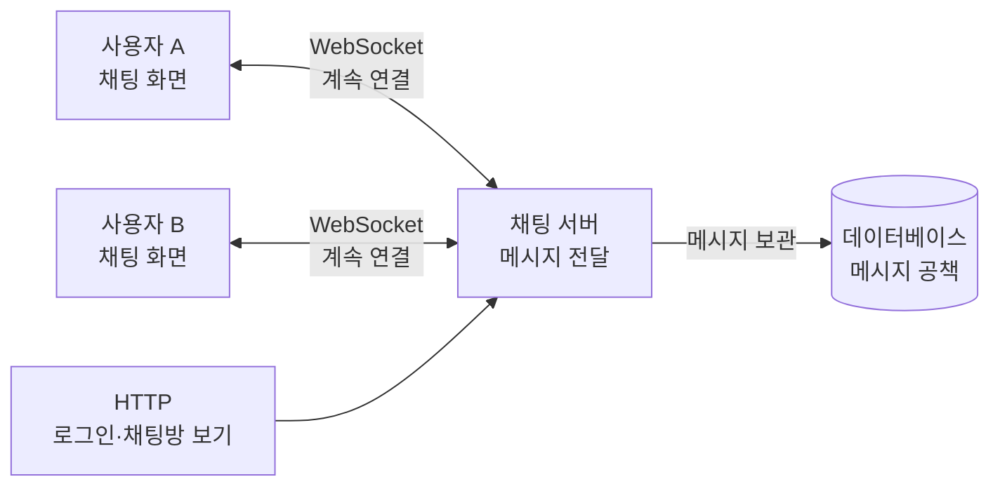
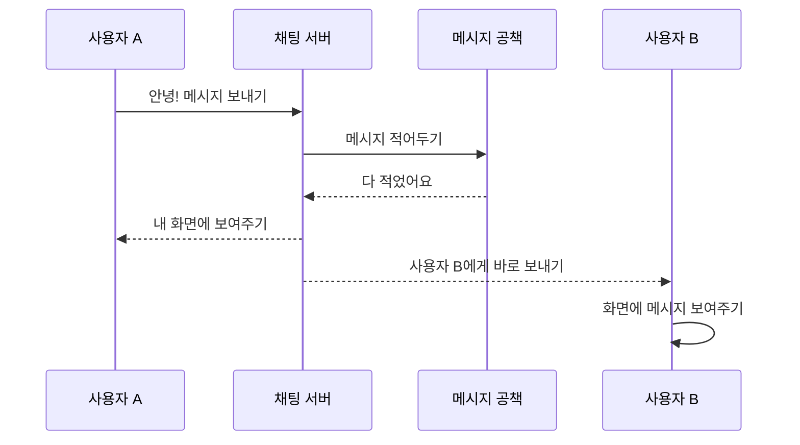

# WebSocket 쉽게 이해하기

## 1. WebSocket이란?

WebSocket은 컴퓨터와 서버가 **계속 연결된 상태로 대화하게 해주는 방법**이다.

친구에게 편지를 보내는 것과 전화하는 것을 생각해 보자.

- HTTP는 편지와 비슷하다. 내가 편지를 보내야 친구가 답장을 보낸다.
- WebSocket은 전화와 비슷하다. 전화를 한 번 연결하면 서로 언제든지 말할 수 있다.

그래서 채팅처럼 **새로운 소식이 생기자마자 알려줘야 하는 서비스**에 잘 어울린다.

## 2. 어떻게 연결될까?

1. 브라우저가 서버에게 “연결해도 될까요?”라고 물어본다.
2. 서버가 “네!”라고 대답하면 연결이 만들어진다.
3. 연결된 동안 서로 메시지를 보낼 수 있다.
4. 채팅이 끝나거나 인터넷이 끊기면 연결이 끝난다.

```text
브라우저                         서버
   │                              │
   │  연결해도 될까요? ──────────► │
   │ ◄────────────── 네, 좋아요!  │
   │                              │
   │ ◄─────── 메시지 주고받기 ───► │
```

## 3. HTTP와 WebSocket은 무엇이 다를까?

| 구분 | HTTP | WebSocket |
|---|---|---|
| 비유 | 편지 | 전화 |
| 대화 방법 | 내가 물어봐야 답을 받음 | 서로 아무 때나 말할 수 있음 |
| 연결 | 필요한 일을 끝내면 끝날 수 있음 | 연결을 계속 유지함 |
| 새 메시지 알림 | 직접 계속 물어봐야 함 | 서버가 바로 알려줌 |
| 잘 어울리는 곳 | 웹페이지 보기, 물건 목록 보기 | 채팅, 게임, 실시간 알림 |

HTTP가 나쁜 것은 아니다. 웹페이지를 보여주거나 로그인하는 일에는 HTTP가 편리하고, 실시간 채팅에는 WebSocket이 편리하다. 실제 서비스에서는 둘을 함께 사용한다.

## 4. 실시간 채팅 서비스 구조

채팅방을 선생님이 관리하는 교실이라고 생각하면 쉽다.

- **브라우저**: 학생이 사용하는 채팅 화면
- **채팅 서버**: 메시지를 받아서 친구들에게 전달하는 선생님
- **데이터베이스**: 메시지를 잊지 않도록 보관하는 공책



Mermaid 그림이 보이지 않는 곳에서는 아래처럼 생각하면 된다.

```text
┌──────────────┐      계속 연결       ┌──────────────┐
│ 사용자 A 화면 │ ◄──────────────────► │              │
└──────────────┘                       │  채팅 서버   │ ──► 메시지 공책
┌──────────────┐      계속 연결       │              │     (데이터베이스)
│ 사용자 B 화면 │ ◄──────────────────► │              │
└──────────────┘                       └──────────────┘
```

## 5. 메시지는 어떻게 전달될까?



쉽게 순서대로 보면 다음과 같다.

1. 사용자 A가 “안녕!”이라고 입력한다.
2. A의 브라우저가 WebSocket으로 채팅 서버에 보낸다.
3. 채팅 서버가 메시지를 공책(데이터베이스)에 적는다.
4. 채팅 서버가 같은 채팅방의 친구들에게 메시지를 보내준다.
5. 사용자 B의 화면에 메시지가 바로 나타난다.

## 6. 메시지는 어떤 모양일까?

서버가 메시지를 헷갈리지 않도록 이름표를 붙여서 보낸다. 보통 JSON이라는 알아보기 쉬운 형식을 사용한다.

```json
{
  "방 번호": "room-1",
  "보낸 사람": "user-1",
  "내용": "안녕하세요!"
}
```

## 7. 만들 때 꼭 생각할 것

- **누구인지 확인하기**: 아무나 채팅방에 들어오지 못하게 한다.
- **방을 확인하기**: 다른 채팅방에 메시지가 잘못 가지 않게 한다.
- **메시지 보관하기**: 나중에 들어와도 이전 대화를 볼 수 있게 한다.
- **인터넷이 끊겼을 때 다시 연결하기**: 잠깐 끊겨도 채팅을 계속할 수 있게 한다.
- **안전하게 사용하기**: 운영할 때는 암호화된 `wss://` 연결을 사용한다.

한마디로 정리하면, **HTTP는 편지처럼 필요한 때 물어보는 방법이고, WebSocket은 전화처럼 계속 연결해서 바로바로 이야기하는 방법**이다. 실시간 채팅에서는 WebSocket을 사용하면 친구의 메시지가 도착하자마자 화면에 나타난다.
